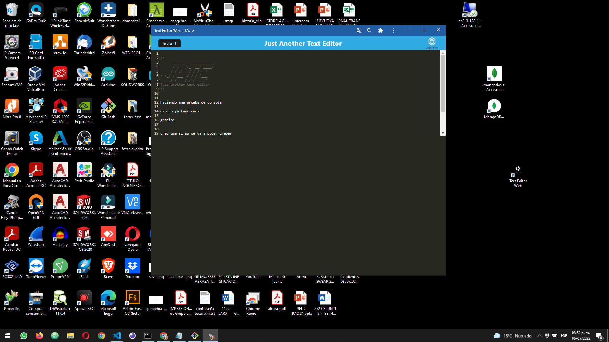

#  👓 Text Editor

## 📄 Description

This is a text editor than runs in the browser, it was made using PWA criteria, service worker, webpack. The tecnology inside is nodejs, express, IndexedDB, LocalStorage. With PWA you can use the App offline and save the changes. The fullstack App was deployed in Heroku.

## ⚙⚙ Web Page Functionality

The following image shows the Tech Blog application's appearance:

You can get in into the App in the next link in Heroku [Text Editor](https://text-editor-magg.herokuapp.com/) for testing.
